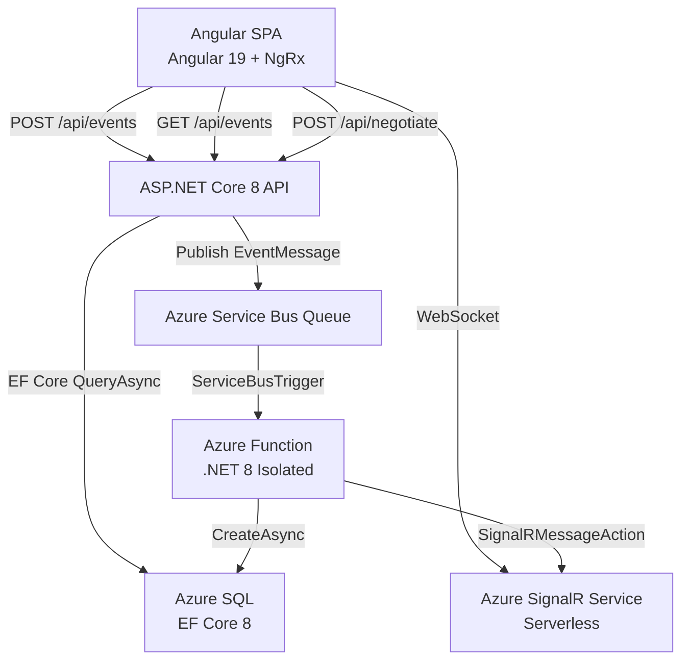

# Event Hub

## Overview

Event Hub is a real-time event tracking application built with a modern cloud-native stack. It enables users to submit events through a form, processes them asynchronously via Azure Service Bus, persists them to Azure SQL, and broadcasts live updates to all connected clients using Azure SignalR Service.


**Key components:**

| Component | Technology |
|-----------|-----------|
| Frontend SPA | Angular 19 + NgRx |
| REST API | ASP.NET Core 8 Web API |
| Event Processor | Azure Functions v4 (.NET 8 isolated worker) |
| Database | Azure SQL (EF Core 8) |
| Message Broker | Azure Service Bus Queue |
| Real-Time Service | Azure SignalR Service (Serverless) |

## Table of Contents

- [Overview](#overview)
- [Architecture](#architecture)
- [End-to-End Data Flow](#end-to-end-data-flow)
- [Project Structure](#project-structure)
- [Getting Started](#getting-started)
- [API Documentation](#api-documentation)
- [Architectural Decision Records](#architectural-decision-records-adrs)
- [BMAD Planning Artifacts](#bmad-planning-artifacts)

---

## Architecture

### Architecture Diagram



### Technology Stack

| Layer | Technology | Version |
|-------|-----------|---------|
| Frontend Framework | Angular | 19.x LTS |
| UI Components | Angular Material | 19.x |
| State Management | NgRx Store + Effects | 19.x |
| Real-time Client | `@microsoft/signalr` | 8.x |
| Backend Framework | ASP.NET Core | 8.0 LTS |
| Event Processor | Azure Functions | v4 (isolated worker) |
| Runtime | .NET | 8.0 LTS |
| ORM | EF Core | 8.x |
| Database | Azure SQL | - |
| Message Broker | Azure Service Bus Queue | - |
| Real-time Service | Azure SignalR Service (Serverless) | - |
| Logging | Serilog | 10.x (ASP.NET sink) |
| API Documentation | Swashbuckle.AspNetCore | 6.4.0 |
| Backend Testing | xUnit + Moq | - |
| Frontend Testing | Karma + Jasmine | - |
| Node.js | Node.js | 22.x LTS |

---

## End-to-End Data Flow

The full pipeline from form submission to live table update:

1. **Form submit** → User fills the event creation form in the Angular SPA
2. **NgRx dispatch** → Angular dispatches `[EventForm] Submit Event` action to the NgRx store
3. **HTTP POST** → `EventService.create()` sends `POST /api/events` to the ASP.NET Core API
4. **Controller** → `EventsController` validates the request and calls `IServiceBusPublisher.PublishAsync()`
5. **Service Bus** → The API publishes an `EventMessage` to the Azure Service Bus Queue
6. **Azure Function trigger** → `[ServiceBusTrigger] ProcessEvent` fires, calling `EventProcessingService`
7. **Database write** → `IEventRepository.CreateAsync()` executes `INSERT` into Azure SQL via EF Core 8
8. **SignalR broadcast** → Function uses `SignalRMessageAction("newEvent")` output binding to push the new event to Azure SignalR Service
9. **Client receives** → Angular `SignalRService.on("newEvent")` receives the push notification
10. **NgRx update** → Dispatches `[SignalR] Event Received` → table re-fetches from API + flying chip animation lands in the table

---

## Project Structure

```
event-hub/
├── README.md                              ← This file
├── CLAUDE.md
├── EventHub.sln
├── .editorconfig
├── .gitignore
├── src/
│   ├── EventHub.Domain/                   ← Domain entities & value objects
│   ├── EventHub.Application/              ← Application layer (CQRS, interfaces)
│   ├── EventHub.Infrastructure/           ← EF Core, repositories, Service Bus
│   ├── EventHub.Api/                      ← ASP.NET Core 8 Web API
│   ├── EventHub.Function/                 ← Azure Functions v4 event processor
│   └── frontend/                          ← Angular 19 SPA (has own README.md)
├── tests/
│   ├── EventHub.Api.Tests/                ← xUnit API integration tests (28)
│   └── EventHub.Function.Tests/           ← xUnit Function unit tests (15)
├── _bmad-output/
│   └── planning-artifacts/
│       ├── project-brief.md
│       ├── prd.md
│       ├── architecture.md
│       └── ux-design-specification.md
└── docs/
```

The .NET backend follows **Clean Architecture** with a strict dependency rule — inner layers never reference outer layers:

```
EventHub.Domain          ← Entities, Enums (zero dependencies)
  ↑
EventHub.Application     ← DTOs, Interfaces, Messages
  ↑
EventHub.Infrastructure  ← EF Core, Repositories, Service Bus
  ↑                ↑
EventHub.Api       EventHub.Function
```

Both `EventHub.Api` and `EventHub.Function` reference `Application` + `Infrastructure` but never each other. This keeps the event processing pipeline fully decoupled from the HTTP layer.

---

## Getting Started

### Prerequisites

Ensure the following tools are installed before proceeding:

| Tool | Version | Install |
|------|---------|---------|
| Node.js | 22.x LTS | [nodejs.org](https://nodejs.org) |
| .NET SDK | 8.0 LTS | [dot.net](https://dot.net/download) |
| Angular CLI | Latest | `npm install -g @angular/cli` |
| Azure CLI | Latest | `winget install Microsoft.AzureCLI` |
| Azure Functions Core Tools | v4 | `npm install -g azure-functions-core-tools@4` |
| dotnet-ef | Latest | `dotnet tool install --global dotnet-ef` |
| Git | Latest | [git-scm.com](https://git-scm.com) |

### Clone and Install Dependencies

```bash
git clone <repository-url>
cd event-hub

# Restore NuGet packages
dotnet restore

# Install Angular dependencies
cd src/frontend && npm install && cd ../..
```

### Trust the HTTPS Development Certificate

Required for the browser to accept the API running on `https://localhost:5001`:

```bash
dotnet dev-certs https --trust
```

### Azure Resource Provisioning

Create the required Azure resources using the Azure CLI:

```bash
# Variables — adjust to your environment
RESOURCE_GROUP="event-hub-rg"
LOCATION="eastus"
SQL_SERVER="event-hub-sql-server"
SQL_DB="EventHubDb"
SB_NAMESPACE="event-hub-sb"
SIGNALR_NAME="event-hub-signalr"

# Resource group
az group create --name $RESOURCE_GROUP --location $LOCATION

# Azure SQL Server and Database
az sql server create --name $SQL_SERVER --resource-group $RESOURCE_GROUP \
  --location $LOCATION --admin-user sqladmin --admin-password <your-password>
az sql db create --server $SQL_SERVER --resource-group $RESOURCE_GROUP \
  --name $SQL_DB --service-objective Basic

# Azure Service Bus (Basic tier, single queue named "events")
az servicebus namespace create --name $SB_NAMESPACE --resource-group $RESOURCE_GROUP \
  --location $LOCATION --sku Basic
az servicebus queue create --name events --namespace-name $SB_NAMESPACE \
  --resource-group $RESOURCE_GROUP

# Azure SignalR Service (Serverless mode, Free tier)
az signalr create --name $SIGNALR_NAME --resource-group $RESOURCE_GROUP \
  --sku Free_F1 --service-mode Serverless
```

After provisioning, retrieve the connection strings from the Azure Portal or via CLI.

### Configuration

**Do not commit connection strings.** Place them in gitignored local config files:

**API — `src/EventHub.Api/appsettings.Development.json`:**

```json
{
  "ConnectionStrings": {
    "DefaultConnection": "Server=tcp:<server>.database.windows.net,1433;Initial Catalog=EventHubDb;Persist Security Info=False;User ID=sqladmin;Password=<password>;MultipleActiveResultSets=False;Encrypt=True;TrustServerCertificate=False;Connection Timeout=30;"
  },
  "AzureServiceBus": {
    "ConnectionString": "Endpoint=sb://<namespace>.servicebus.windows.net/;SharedAccessKeyName=RootManageSharedAccessKey;SharedAccessKey=<key>",
    "QueueName": "events"
  },
  "AzureSignalRConnectionString": "Endpoint=https://<name>.service.signalr.net;AccessKey=<key>;Version=1.0;"
}
```

**Function — `src/EventHub.Function/local.settings.json`:**

```json
{
  "IsEncrypted": false,
  "Values": {
    "FUNCTIONS_WORKER_RUNTIME": "dotnet-isolated",
    "AzureWebJobsServiceBus": "Endpoint=sb://<namespace>.servicebus.windows.net/;SharedAccessKeyName=RootManageSharedAccessKey;SharedAccessKey=<key>",
    "ServiceBusQueueName": "events",
    "SqlConnectionString": "Server=tcp:<server>.database.windows.net,1433;Initial Catalog=EventHubDb;...",
    "AzureSignalRConnectionString": "Endpoint=https://<name>.service.signalr.net;AccessKey=<key>;Version=1.0;"
  }
}
```

**Angular — `src/frontend/src/environments/environment.ts`:**

```typescript
export const environment = {
  production: false,
  apiUrl: 'https://localhost:5001'
};
```

> **Tip:** You can also create `src/EventHub.Api/appsettings.development.local.json` (gitignored) for local overrides without modifying `appsettings.Development.json`.

### Database Migration

Run EF Core migrations after configuring the connection string and **before** the first API start:

```bash
cd src/EventHub.Api
dotnet ef database update
```

### Running Locally

Open **3 separate terminal windows** and start each component:

**Terminal 1 — Angular SPA:**

```bash
cd src/frontend
ng serve
# Available at: http://localhost:4200
```

**Terminal 2 — ASP.NET Core API:**

```bash
cd src/EventHub.Api
dotnet run
# Available at: https://localhost:5001
# Swagger UI at: https://localhost:5001/swagger
```

**Terminal 3 — Azure Function:**

```bash
cd src/EventHub.Function
func start
# Available at: http://localhost:7071
```

> **Run order:** The API and Function can start in any order. Start Angular last (it reads the API URL from `environment.ts`). All 3 must be running for a full end-to-end experience.

---

## API Documentation

Swagger UI is available when the API is running locally:

- **URL:** `https://localhost:5001/swagger`
- **Documented endpoints:**
  - `POST /api/events` — Submit a new event
  - `GET /api/events` — List events with server-side filtering, sorting, and pagination
  - `POST /api/negotiate` — Azure SignalR negotiate endpoint

---

## Architectural Decision Records (ADRs)

Full ADR trade-off tables are documented in [_bmad-output/planning-artifacts/architecture.md](_bmad-output/planning-artifacts/architecture.md). The summaries below capture the key decisions.

### ADR-1: Database — Azure SQL

**Decision:** Azure SQL (via EF Core 8) over Cosmos DB.

**Trade-off:**

| Factor | Azure SQL ✅ | Cosmos DB ❌ |
|--------|------------|------------|
| Filtering & sorting | Native SQL `WHERE`/`ORDER BY` for FR7–FR12, FR31–FR32 | Composite queries complex, limited `OFFSET` scan support |
| Idempotency | `UNIQUE` constraint enforces NFR-I2 | Requires manual deduplication logic |
| ORM support | Full EF Core `IQueryable` support | Limited EF Core provider |
| Pagination | `OFFSET`/`FETCH` maps cleanly to `Skip().Take()` | Requires continuation tokens |

**Conclusion:** Azure SQL is the right tool for structured, query-heavy, relational event data at this scale.

---

### ADR-2: Messaging — Service Bus Queue

**Decision:** Azure Service Bus Queue over Topic + Subscription.

**Trade-off:**

| Factor | Queue ✅ | Topic + Subscription ❌ |
|--------|---------|----------------------|
| Consumer model | Single consumer (Azure Function) — Queue is sufficient | Multi-consumer fan-out not needed for MVP |
| Delivery guarantee | At-least-once delivery satisfies NFR-I1 | Same guarantee, more configuration overhead |
| Configuration | Minimal setup for MVP | Subscription filters add complexity |
| Post-MVP migration | Easy to migrate if fan-out needed | Ready out of the box |

**Conclusion:** Queue meets all current requirements with minimal overhead. Topic + Subscription remains the post-MVP path if multiple consumers are needed.

---

### ADR-3: Real-Time — Azure SignalR Service (Serverless)

**Decision:** Azure SignalR Service in Serverless mode over API-hosted SignalR Hub.

**Trade-off:**

| Factor | Serverless SignalR ✅ | API-hosted Hub ❌ |
|--------|---------------------|-----------------|
| Function integration | 1-line `SignalRMessageAction` output binding | Function needs `HttpClient` call to API hub |
| Coupling | API only needs negotiate endpoint (clean separation) | Introduces coupling between Function and API |
| Cost | Free tier (20 concurrent connections) sufficient | Requires persistent WebSocket connections in API |
| Scalability | Managed scaling by Azure | Manual hub scaling required |

**Conclusion:** Serverless mode provides the cleanest integration with Azure Functions and eliminates the Function→API coupling problem.

---

### ADR-4: Project Structure — Monorepo

**Decision:** Single repository with folder-based separation.

**Rationale:** Solo developer context makes a monorepo the clear choice:
- Single `git clone` gets the entire system
- One README covers the full architecture
- All components (frontend, API, Function, tests) are traceable from one repo
- No cross-repo dependency management overhead
- Architecture is visible end-to-end for reviewers

**Structure:** `/src/frontend/`, `/src/EventHub.Api/`, `/src/EventHub.Function/`, `/tests/`

---

### ADR-5: State Management — NgRx Store

**Decision:** NgRx Store + Effects over Services + Signals.

**Trade-off:**

| Factor | NgRx ✅ | Services + Signals ❌ |
|--------|--------|---------------------|
| Complex state coordination | Coordinates pagination + filters + sort + SignalR + animations declaratively | Tangled observables when coordinating filter debounce, pagination reset, and SignalR integration |
| Predictability | Single source of truth, time-travel debugging | Distributed state across services is harder to debug |
| Enterprise signal | Demonstrates senior Angular architecture skills | Simpler but less impressive for a technical interview project |
| Boilerplate | More upfront setup | Less boilerplate, but harder to scale |

**Conclusion:** NgRx is the right choice for coordinating the 5+ concurrent state dimensions this application manages.

---

### ADR-6: Pagination — Server-Side

**Decision:** Server-side pagination (`GET /api/events?page=1&pageSize=20&sortBy=createdAt&sortDir=desc`) over client-side (`MatTableDataSource`).

**Trade-off:**

| Factor | Server-Side ✅ | Client-Side (`MatTableDataSource`) ❌ |
|--------|--------------|--------------------------------------|
| Scalability | Works for any dataset size | Only viable for small datasets |
| Data access patterns | Demonstrates `IQueryable .Where().OrderBy().Skip().Take()` | Loads all rows into memory |
| Reviewer signal | Shows proper backend pagination design | Would be flagged as a shortcut by technical reviewers |
| EF Core alignment | Maps naturally to SQL `OFFSET`/`FETCH` | Bypasses ORM capabilities |

**Conclusion:** Server-side pagination demonstrates correct data access patterns and is the only viable choice for production-grade applications.

---

## BMAD Planning Artifacts

The following planning documents were produced using the BMAD methodology and are available in this repository:

| Artifact | Path |
|----------|------|
| Project Brief | [_bmad-output/planning-artifacts/project-brief.md](_bmad-output/planning-artifacts/project-brief.md) |
| Product Requirements Document (PRD) | [_bmad-output/planning-artifacts/prd.md](_bmad-output/planning-artifacts/prd.md) |
| Architecture Decision Document | [_bmad-output/planning-artifacts/architecture.md](_bmad-output/planning-artifacts/architecture.md) |
| UX Design Specification | [_bmad-output/planning-artifacts/ux-design-specification.md](_bmad-output/planning-artifacts/ux-design-specification.md) |
