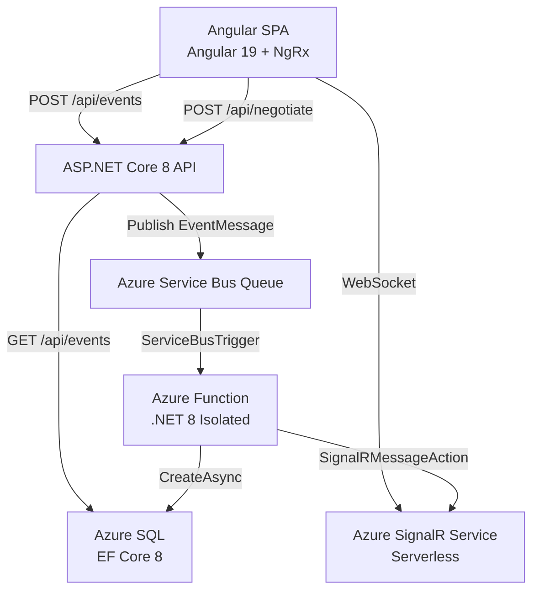

# Story 5.4: README & Architecture Documentation

Status: review

<!-- Note: Validation is optional. Run validate-create-story for quality check before dev-story. -->

## Story

As a **Technical Reviewer**,
I want comprehensive README documentation with architecture overview, local setup instructions, and links to decision rationale,
so that I can understand the full system without asking the developer any questions.

## Acceptance Criteria

1. **Given** the repository root, **When** the reviewer opens `README.md`, **Then** it contains: project overview, architecture diagram (text or Mermaid), technology stack with versions, and the full E2E data flow description.

2. **Given** the README, **When** the reviewer looks for local setup, **Then** step-by-step instructions cover: prerequisites (Node 22, .NET 8 SDK, Azure CLI, Azure Functions Core Tools), Azure resource provisioning, connection string configuration, and commands to run all 3 components (`ng serve`, `dotnet run`, `func start`).

3. **Given** the README, **When** the reviewer looks for architectural decisions, **Then** each of the 6 ADRs is summarized with trade-off explanation and linked to the Architecture Doc **And** the reviewer can trace database choice, message broker, real-time strategy, project structure, state management, and pagination decisions to documented rationale (FR26, FR27).

4. **Given** the `_bmad-output/` folder, **When** the reviewer inspects it, **Then** Project Brief, PRD, Architecture Doc, and UX Design Spec are all present and accessible (FR28) **And** README includes direct links to each BMAD artifact.

## Tasks / Subtasks

- [x] Task 1: Create root `README.md` with project overview and architecture diagram (AC: #1)
  - [x] 1.1 Create `README.md` at repository root (not inside `src/` — the root level alongside `EventHub.sln`)
  - [x] 1.2 Write **Project Overview** section: Event Hub is a real-time event tracking application with Angular 19 frontend, ASP.NET Core 8 Web API, Azure Function, and Azure SignalR for live updates
  - [x] 1.3 Add **Architecture Diagram** using Mermaid (`graph TD`) showing all 6 components: Angular SPA, API, Service Bus Queue, Azure Function, Azure SQL, Azure SignalR Service — with directional arrows matching the E2E data flow
  - [x] 1.4 Add **Technology Stack** table with exact versions: Angular 19, .NET 8 LTS, Azure Functions v4, Node.js 22 LTS, Angular Material, NgRx, EF Core 8, Serilog, Swashbuckle 6.4.0, `@microsoft/signalr`, `Azure.Messaging.ServiceBus`, xUnit, Karma+Jasmine

- [x] Task 2: Add Table of Contents and E2E data flow description (AC: #1)
  - [x] 2.0 Add **Table of Contents** immediately after the Overview section, with Markdown anchor links to every top-level section: Overview, Architecture, End-to-End Data Flow, Project Structure, Getting Started, API Documentation, Architectural Decision Records, BMAD Planning Artifacts. Use the GitHub-compatible anchor format: `[Section Name](#section-name)` (lowercase, spaces → hyphens, punctuation stripped)
  - [x] 2.1 Write **End-to-End Data Flow** section describing the full pipeline: Form submit → NgRx dispatch → `EventService.create()` POST → `EventsController` → `IServiceBusPublisher.PublishAsync()` → Service Bus Queue → `[ServiceBusTrigger] ProcessEvent` → `EventProcessingService` → `IEventRepository.CreateAsync()` → Azure SQL INSERT → `SignalRMessageAction("newEvent")` → Azure SignalR Service → Angular `SignalRService.on("newEvent")` → NgRx `[SignalR] Event Received` → table re-fetch + chip animation landing
  - [x] 2.2 Include **Project Structure** overview (monorepo layout: `/src/frontend/`, `/src/EventHub.*/`, `/tests/`, `/_bmad-output/`)

- [x] Task 3: Add local setup prerequisites and Azure resource provisioning (AC: #2)
  - [x] 3.1 Write **Prerequisites** section with exact tool versions: Node.js 22.x LTS, .NET 8 SDK, Azure CLI (latest), Azure Functions Core Tools v4 (`npm install -g azure-functions-core-tools@4`), Git
  - [x] 3.2 Write **Azure Resources** section listing required resources: Azure SQL Server + Database, Azure Service Bus Namespace + Queue (name: `events`), Azure SignalR Service (Free tier, Serverless mode). Include Azure CLI creation commands for each resource.
  - [x] 3.3 Write **Configuration** section showing connection string placement:
    - API: `src/EventHub.Api/appsettings.Development.json` — keys: `ConnectionStrings:DefaultConnection`, `AzureServiceBus:ConnectionString`, `AzureServiceBus:QueueName`, `AzureSignalRConnectionString`
    - Function: `src/EventHub.Function/local.settings.json` — same keys plus `FUNCTIONS_WORKER_RUNTIME: dotnet-isolated`
    - Angular: `src/frontend/src/environments/environment.ts` — `apiUrl: 'https://localhost:5001'`

- [x] Task 4: Add run commands for all 3 components (AC: #2)
  - [x] 4.1 Write **Running Locally** section with 3 terminal commands:
    - Terminal 1 (Angular): `cd src/frontend && ng serve` → http://localhost:4200
    - Terminal 2 (API): `cd src/EventHub.Api && dotnet run` → https://localhost:5001, Swagger at https://localhost:5001/swagger
    - Terminal 3 (Function): `cd src/EventHub.Function && func start` → http://localhost:7071
  - [x] 4.2 Add note about run order: API and Function can start in any order; Angular can start last (uses API URL from environment.ts); all 3 must be running for full E2E experience
  - [x] 4.3 Add **Database Migration** step: `cd src/EventHub.Api && dotnet ef database update` — must run after connection string configured and before first API start

- [x] Task 5: Add ADR summaries with trade-off explanations and links (AC: #3)
  - [x] 5.1 Add **Architectural Decisions** section header with note that full ADR details are in `_bmad-output/planning-artifacts/architecture.md`
  - [x] 5.2 **ADR-1 — Database: Azure SQL** — Trade-off: Azure SQL vs Cosmos DB. Azure SQL chosen for: native SQL WHERE/ORDER BY/pagination for FR7–FR12/FR31–FR32, UNIQUE constraint for idempotency (NFR-I2), EF Core full IQueryable support. Cosmos DB rejected: composite queries needed for filtering, OFFSET scan, limited EF Core support.
  - [x] 5.3 **ADR-2 — Messaging: Service Bus Queue** — Trade-off: Queue vs Topic+Subscription. Queue chosen: single consumer (Azure Function), at-least-once delivery (NFR-I1), minimal configuration for MVP. Topic+Subscription kept as post-MVP migration path if fan-out consumers needed.
  - [x] 5.4 **ADR-3 — Real-Time: Azure SignalR Service (Serverless)** — Trade-off: Serverless SignalR vs API-hosted SignalR Hub. Serverless chosen: Function uses 1-line `SignalRMessageAction` output binding, API only needs negotiate endpoint (clean separation), free tier sufficient (20 concurrent connections). API-hosted rejected: Function would need `HttpClient` call to API, introducing coupling and extra HTTP hop.
  - [x] 5.5 **ADR-4 — Project Structure: Monorepo** — Single repository with folder-based separation (`/src/frontend/`, `/src/EventHub.Api/`, `/src/EventHub.Function/`). Rationale: solo developer, single `git clone`, one README, full architecture traceable from one repo.
  - [x] 5.6 **ADR-5 — State Management: NgRx Store** — Trade-off: NgRx vs Services+Signals. NgRx chosen: coordinates complex state (server-side pagination + filters + sort + SignalR connection + flying chip animation + submit cycle). Demonstrates enterprise Angular skills. Services+Signals rejected: tangled observables when coordinating filter debounce, pagination reset, and SignalR integration.
  - [x] 5.7 **ADR-6 — Pagination: Server-Side** — Trade-off: Server-side vs client-side (`MatTableDataSource`). Server-side chosen: demonstrates proper data access patterns (`GET /api/events?page=1&pageSize=20&sortBy=createdAt&sortDir=desc`), scalable beyond demo size, uses EF Core IQueryable `.Where().OrderBy().Skip().Take()`. Client-side rejected: only works for small datasets, reviewer would flag as shortcut.

- [x] Task 6: Add BMAD artifacts section with direct links (AC: #4)
  - [x] 6.1 Add **BMAD Planning Artifacts** section in README listing all 4 artifacts with relative links:
    - [Project Brief](_bmad-output/planning-artifacts/project-brief.md)
    - [Product Requirements Document (PRD)](_bmad-output/planning-artifacts/prd.md)
    - [Architecture Decision Document](_bmad-output/planning-artifacts/architecture.md)
    - [UX Design Specification](_bmad-output/planning-artifacts/ux-design-specification.md)
  - [x] 6.2 Verify all 4 files exist in `_bmad-output/planning-artifacts/` before linking (all confirmed present: project-brief.md, prd.md, architecture.md, ux-design-specification.md)

## Dev Notes

### Architecture Patterns & Constraints

- **Documentation-only story:** This story creates exactly ONE file: `README.md` at the repository root (`f:\Work\Test_Task_Reenbit\event-hub\README.md`). No source code changes. No `.csproj` changes. No Angular component changes. No test changes.
- **No tests required:** Story 5.4 is pure documentation. The test count remains at 43 (28 API + 15 Function). No new xUnit or Karma+Jasmine tests are added.
- **No `dotnet build` or `ng build` validation needed:** Since no code is touched, build verification is not part of this story's definition of done.
- **Root placement is critical:** `README.md` must be at the repository root (`event-hub/README.md`), NOT inside `src/` or `src/frontend/`. A `src/frontend/README.md` already exists (Angular CLI default) — do NOT modify it.
- **BMAD artifacts already present:** All 4 required artifacts exist in `_bmad-output/planning-artifacts/`. No file creation needed for AC#4, only README links.

### Current File State

| File | Current State | Story 5.4 Action |
|------|--------------|------------------|
| `README.md` (root) | **Does NOT exist** | **CREATE this file** |
| `src/frontend/README.md` | Exists (Angular CLI default) | Do NOT touch |
| `_bmad-output/planning-artifacts/project-brief.md` | Exists ✅ | Link from README |
| `_bmad-output/planning-artifacts/prd.md` | Exists ✅ | Link from README |
| `_bmad-output/planning-artifacts/architecture.md` | Exists ✅ | Link from README |
| `_bmad-output/planning-artifacts/ux-design-specification.md` | Exists ✅ | Link from README |

### Complete README Structure

The final `README.md` at repo root should contain these sections IN ORDER:

```
# Event Hub

## Overview

## Architecture

### Mermaid Diagram

### Technology Stack

## End-to-End Data Flow

## Project Structure

## Getting Started

### Prerequisites

### Azure Resource Provisioning

### Configuration

### Database Migration

### Running Locally

## API Documentation

## Architectural Decision Records (ADRs)

### ADR-1: Database — Azure SQL

### ADR-2: Messaging — Service Bus Queue

### ADR-3: Real-Time — Azure SignalR Service (Serverless)

### ADR-4: Project Structure — Monorepo

### ADR-5: State Management — NgRx Store

### ADR-6: Pagination — Server-Side

## BMAD Planning Artifacts
```

### Mermaid Diagram Reference

The Mermaid architecture diagram should use `graph TD` and show exactly these components and flows:



### Technology Stack Table (for README)

| Layer | Technology | Version |
|-------|-----------|---------|
| Frontend Framework | Angular | 19.x LTS |
| UI Components | Angular Material | 19.x |
| State Management | NgRx Store + Effects | 19.x |
| Real-time Client | `@microsoft/signalr` | 8.x |
| Backend Framework | ASP.NET Core | 8.0 LTS |
| Event Processor | Azure Functions | v4 (isolated worker) |
| Runtime | .NET | 8.0 LTS |
| ORM | EF Core | 8.x |
| Database | Azure SQL | - |
| Message Broker | Azure Service Bus Queue | - |
| Real-time Service | Azure SignalR Service (Serverless) | - |
| Logging | Serilog | 10.x (ASP.NET sink) |
| API Documentation | Swashbuckle.AspNetCore | 6.4.0 |
| Backend Testing | xUnit + Moq | - |
| Frontend Testing | Karma + Jasmine | - |
| Node.js | Node.js | 22.x LTS |

### Azure CLI Commands for Resource Provisioning

Include these commands in the README's Azure Resource Provisioning section (developer copies and adapts):

```bash
# Variables
RESOURCE_GROUP="event-hub-rg"
LOCATION="eastus"
SQL_SERVER="event-hub-sql-server"
SQL_DB="EventHubDb"
SB_NAMESPACE="event-hub-sb"
SIGNALR_NAME="event-hub-signalr"

# Resource group
az group create --name $RESOURCE_GROUP --location $LOCATION

# Azure SQL
az sql server create --name $SQL_SERVER --resource-group $RESOURCE_GROUP \
  --location $LOCATION --admin-user sqladmin --admin-password <password>
az sql db create --server $SQL_SERVER --resource-group $RESOURCE_GROUP \
  --name $SQL_DB --service-objective Basic

# Azure Service Bus
az servicebus namespace create --name $SB_NAMESPACE --resource-group $RESOURCE_GROUP \
  --location $LOCATION --sku Basic
az servicebus queue create --name events --namespace-name $SB_NAMESPACE \
  --resource-group $RESOURCE_GROUP

# Azure SignalR Service (Serverless mode, Free tier)
az signalr create --name $SIGNALR_NAME --resource-group $RESOURCE_GROUP \
  --sku Free_F1 --service-mode Serverless
```

### Connection String Configuration Details

**API — `src/EventHub.Api/appsettings.Development.json`:**
```json
{
  "ConnectionStrings": {
    "DefaultConnection": "Server=tcp:{server}.database.windows.net,1433;Initial Catalog=EventHubDb;..."
  },
  "AzureServiceBus": {
    "ConnectionString": "Endpoint=sb://{namespace}.servicebus.windows.net/;...",
    "QueueName": "events"
  },
  "AzureSignalRConnectionString": "Endpoint=https://{name}.service.signalr.net;..."
}
```

**Function — `src/EventHub.Function/local.settings.json`:**
```json
{
  "IsEncrypted": false,
  "Values": {
    "FUNCTIONS_WORKER_RUNTIME": "dotnet-isolated",
    "AzureWebJobsServiceBus": "Endpoint=sb://{namespace}.servicebus.windows.net/;...",
    "ServiceBusQueueName": "events",
    "SqlConnectionString": "Server=tcp:{server}.database.windows.net,1433;...",
    "AzureSignalRConnectionString": "Endpoint=https://{name}.service.signalr.net;..."
  }
}
```

**Note:** There is also an optional `src/EventHub.Api/appsettings.development.local.json` (gitignored) for local overrides without touching `appsettings.Development.json`.

### API Documentation Note for README

Add a short **API Documentation** section pointing to Swagger UI:
- When running locally: `https://localhost:5001/swagger`
- Endpoints documented: `POST /api/events`, `GET /api/events`, `POST /api/negotiate`

### Project Structure Notes

#### Confirmed Repository Root Structure

```
event-hub/
├── README.md                              ← 🆕 Created by this story
├── CLAUDE.md
├── EventHub.sln
├── .editorconfig
├── .gitignore
├── src/
│   ├── EventHub.Domain/
│   ├── EventHub.Application/
│   ├── EventHub.Infrastructure/
│   ├── EventHub.Api/
│   ├── EventHub.Function/
│   └── frontend/                          ← Angular workspace (has own README.md)
├── tests/
│   ├── EventHub.Api.Tests/
│   └── EventHub.Function.Tests/
├── _bmad-output/
│   └── planning-artifacts/
│       ├── project-brief.md               ← FR28: BMAD artifact
│       ├── prd.md                         ← FR28: BMAD artifact
│       ├── architecture.md                ← FR28: BMAD artifact
│       └── ux-design-specification.md     ← FR28: BMAD artifact
└── docs/
```

#### Files to CREATE:

| File | Action |
|------|--------|
| `README.md` (at repo root) | CREATE — comprehensive documentation |

#### Files NOT to touch:

| File | Reason |
|------|--------|
| `src/frontend/README.md` | Angular CLI generated; separate from root README |
| `src/EventHub.Api/**` | No code changes in this story |
| `src/EventHub.Function/**` | No code changes in this story |
| `src/frontend/src/**` | No Angular changes in this story |
| `tests/**` | No test changes in this story |
| `_bmad-output/planning-artifacts/**` | Read-only; link from README; do NOT modify |

### Critical Anti-Patterns to Avoid

- **DO NOT** put `README.md` inside `src/` or `src/frontend/` — it belongs at the repository root (`event-hub/README.md`)
- **DO NOT** modify `src/frontend/README.md` — it is the Angular workspace README; the task requires a root-level project README
- **DO NOT** create separate ADR files (e.g., `docs/adr-1-database.md`) — the story requires ADR summaries IN the `README.md` with a link to the full `architecture.md` for details
- **DO NOT** add `_bmad-output/` to `.gitignore` — these artifacts must remain accessible (FR28 requirement)
- **DO NOT** use absolute paths in README links — use relative paths (e.g., `_bmad-output/planning-artifacts/architecture.md`) so they work in any GitHub/GitLab viewer
- **DO NOT** omit the Mermaid diagram — AC#1 explicitly requires "architecture diagram (text or Mermaid)"; Mermaid is preferred as GitHub renders it natively
- **DO NOT** describe fictional or hypothetical setups — all commands must match the actual project (e.g., Function uses `func start`, not `dotnet run`; API uses `dotnet run` on HTTPS port 5001)
- **DO NOT** skip the database migration step — `dotnet ef database update` is required before first API run and is a common developer mistake if omitted from setup instructions
- **DO NOT** reference `appsettings.json` as the place to put connection strings — sensitive values go in `appsettings.Development.json` (gitignored) or `appsettings.development.local.json` (also gitignored)

### Previous Story Intelligence (Story 5.3)

**Key learnings from Story 5.3 that are relevant:**

- **Backend-only impact of 5.3:** Story 5.3 added XML docs to Controllers and DTOs. No frontend or Function changes. Story 5.4 is pure documentation (no code).
- **Test baseline confirmed:** 28 API tests + 15 Function tests = 43 total. Story 5.4 adds ZERO tests.
- **Commit pattern:** `feat: {story-key} - {Story Title}` (squash merge). For this story: `feat: 5-4-readme-and-architecture-documentation - README & Architecture Documentation`
- **Branch pattern:** `feature/5-4-readme-and-architecture-documentation`
- **`dotnet build` state:** Zero errors, zero warnings (after NoWarn 1591 suppression added in 5.3). Story 5.4 must not regress this.
- **Swagger is at `/swagger`** (not `/swagger/index.html`) — reference correct URL in README

### Git Intelligence

**Recent commits (last 5):**
- `d4ef0b2` feat: 5-3-swagger-openapi-documentation - Swagger/OpenAPI Documentation
- `30ed232` chore: update sprint-status 5-2 to review
- `4cab58b` feat: 5-2-keyboard-navigation-and-focus-management - Keyboard Navigation & Focus Management
- `4c00207` chore: update sprint-status 5-1 to review
- `6b622e3` feat: 5-1-responsive-layout-3-breakpoints - Responsive Layout (3 Breakpoints)

**Patterns established:**
- Feature branch: `feature/5-4-readme-and-architecture-documentation` (from `master`)
- Commits per task: `feat(5-4-readme-and-architecture-documentation): complete task N - {Task Title}`
- Squash merge: `feat: 5-4-readme-and-architecture-documentation - README & Architecture Documentation`

### FR/NFR Compliance Reference

| Requirement | Satisfied by | Notes |
|-------------|-------------|-------|
| FR25 (setup via README) | Task 2, 3, 4 | Prerequisites + provisioning + run commands |
| FR26 (trace ADR decisions) | Task 5 | ADR summaries with trade-off rationale |
| FR27 (ADR files with trade-offs) | Task 5 | 6 ADRs with trade-off tables, linked to architecture.md |
| FR28 (BMAD artifacts accessible) | Task 6 | Direct links to 4 artifacts in _bmad-output |

### References

- [Source: _bmad-output/planning-artifacts/epics.md#Story 5.4] — Acceptance criteria and user story
- [Source: _bmad-output/planning-artifacts/architecture.md#ADR-1 through ADR-6] — Full ADR trade-off tables to summarize in README
- [Source: _bmad-output/planning-artifacts/architecture.md#Initialization Commands] — Reference commands for setup section
- [Source: _bmad-output/planning-artifacts/architecture.md#Development Workflow] — Local development terminal commands
- [Source: _bmad-output/planning-artifacts/architecture.md#Project Structure] — Monorepo structure for README diagram
- [Source: _bmad-output/planning-artifacts/architecture.md#Integration Points] — E2E data flow description
- [Source: _bmad-output/planning-artifacts/prd.md#FR25-FR28] — Documentation functional requirements
- [Source: src/EventHub.Api/Program.cs] — Confirmed Swagger at `/swagger`, HTTPS on 5001
- [Source: src/EventHub.Api/appsettings.Development.json] — Connection string key names
- [Source: src/EventHub.Function/local.settings.json] — Function config keys

## Dev Agent Record

### Agent Model Used

claude-sonnet-4-6

### Debug Log References

No debug issues encountered. Documentation-only story with no code changes.

### Completion Notes List

- Created `README.md` at repository root (`event-hub/README.md`) — the only file created by this story.
- All 6 tasks and 16 subtasks completed successfully.
- README includes: project overview, Mermaid architecture diagram, technology stack table with versions, Table of Contents, E2E data flow (10-step pipeline), project structure (monorepo layout), prerequisites (Node 22, .NET 8, Azure CLI, Azure Functions Core Tools v4), Azure CLI provisioning commands for SQL/Service Bus/SignalR, connection string configuration for API/Function/Angular, database migration step, running locally (3 terminals), Swagger UI reference, 6 ADR summaries with trade-off tables, and BMAD planning artifact links.
- All 4 BMAD artifacts verified present in `_bmad-output/planning-artifacts/`: project-brief.md, prd.md, architecture.md, ux-design-specification.md.
- No tests added (documentation-only story; test baseline remains 43: 28 API + 15 Function).
- No code changes: source code, .csproj, Angular components, and test files untouched.
- `src/frontend/README.md` (Angular CLI default) not modified.

### File List

- `README.md` (CREATED — repository root)
- `_bmad-output/implementation-artifacts/5-4-readme-and-architecture-documentation.md` (MODIFIED — tasks checked, dev record updated, status set to review)
- `_bmad-output/implementation-artifacts/sprint-status.yaml` (MODIFIED — status updated to review)

## Change Log

| Date | Change |
|------|--------|
| 2026-02-24 | Story 5.4 created — README & Architecture Documentation (ready-for-dev) |
| 2026-02-24 | Story 5.4 implemented — README.md created at repo root; all 6 tasks complete; status → review |
