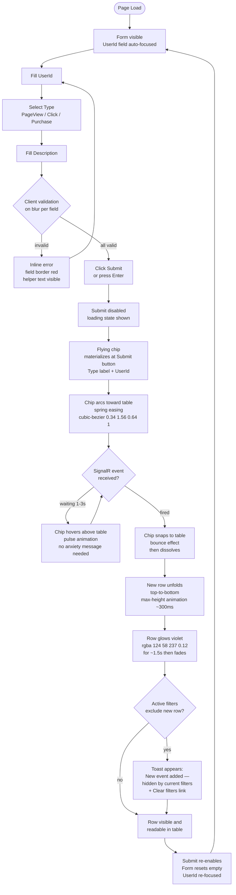
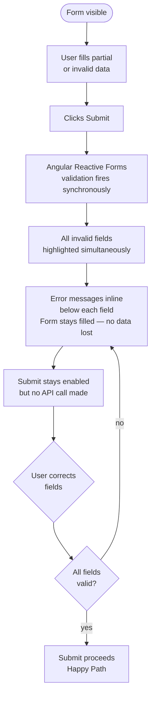
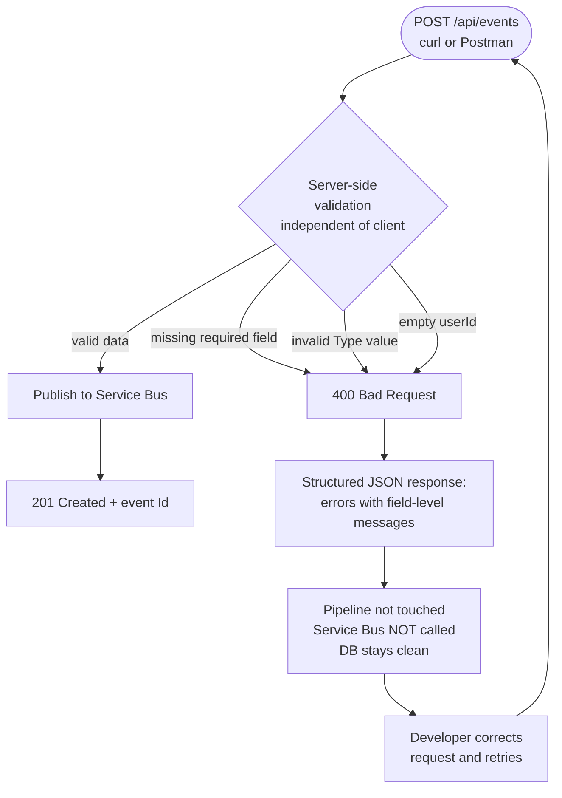
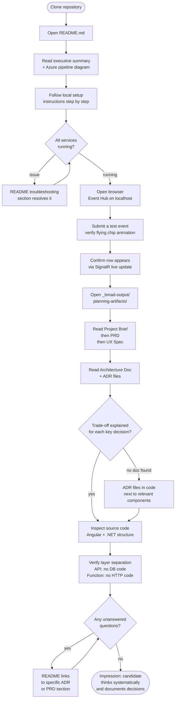
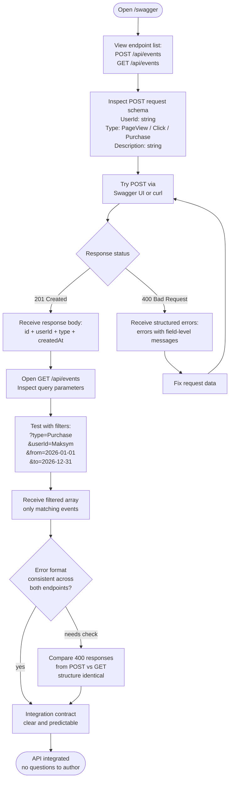

# UX Design Specification event-hub

**Author:** Ssmol
**Date:** 2026-02-20

---

## Executive Summary

### Project Vision

Event Hub is a single-page Angular application that demonstrates a complete cloud-native event
tracking pipeline. Its primary UX goal is dual: deliver a simple, intuitive interface for
end-users creating and viewing events, while simultaneously communicating architectural quality
to a technical reviewer through clean design, transparent feedback loops, and professional polish.

### Target Users

**End-User (Olena)** — A QA specialist or web user who submits typed events via a form and
monitors them in a live-updating table. Tech-savvy enough to use web apps comfortably, but
expects instant, clear feedback. Uses desktop primarily, occasionally tablet/mobile.

**Technical Reviewer (Ivan)** — A senior .NET developer evaluating code quality and architectural
decisions. Interacts with the app briefly to verify functionality, but spends more time reading
README and BMAD artifacts. Expects professional, clean UI that signals quality.

**API Consumer (Maksym)** — A backend developer who integrates via Swagger UI. Does not use
the Angular UI directly.

### Key Design Challenges

1. **Async pipeline transparency** — The 1–3 second delay between form submission and table
   update (via Service Bus → Azure Function → DB → SignalR) must be communicated clearly to
   avoid user confusion about whether their event was accepted.

2. **Filters + live updates coexistence** — When active filters are applied, a newly submitted
   event may not match the current filter set and would be invisible. The UX must handle this
   gracefully (e.g., brief notification or filter-aware display logic).

3. **Responsive table on mobile** — A 5-column data table (Id, UserId, Type, Description,
   CreatedAt) requires a clear mobile strategy (horizontal scroll or collapsed card view).
   Id is a GUID — displayed truncated (8 chars + "…") with full value on hover tooltip.

### Design Opportunities

1. **"Flying event" submit animation** — Upon form submission, a styled chip element animates
   from the form and travels in a soft arc (spring easing, `cubic-bezier(0.34, 1.56, 0.64, 1)`)
   toward the table. The chip displays the event Type and UserId, appears semi-transparent
   during flight (opacity ~0.85), and hovers with a pulsing animation if the SignalR response
   hasn't arrived yet. When the SignalR event fires, the chip "lands" with a bounce effect,
   disappears, and the new table row unfolds top-to-bottom with an accent-color highlight that
   fades out. Submit button is disabled for the full cycle (click → row inserted + highlight
   complete). Multiple simultaneous chips are a post-MVP Growth feature.

2. **Empty state as onboarding** — A well-designed empty table state with a clear call-to-action
   ("Submit your first event using the form above") reduces first-time user confusion.

3. **Pipeline status indicator** — A subtle status chip between the form and table showing
   "Submitted → Processing → Saved" could complement the flying animation during the
   Service Bus processing window.

## Core User Experience

### Defining Experience

The core loop of Event Hub is: **create → watch → filter**. A user fills a minimal
3-field form, submits it, and immediately receives visual confirmation via the "flying
chip" animation — watching their event travel to the table and insert in real time.
This loop must be satisfying on every repetition, not just the first time.

### Platform Strategy

- **Primary platform:** Web browser (desktop), Angular SPA with client-side routing
- **Input method:** Mouse + keyboard primary; touch-friendly for tablet/mobile
- **Connectivity:** Online-only — no offline mode required
- **Mobile approach:** Responsive layout; table uses horizontal scroll on small screens;
  flying animation simplified to fade-out/fade-in on mobile viewports

### Effortless Interactions

- **Always-ready form:** The creation form is permanently visible on the page — no
  modal, no navigation, no "New Event" button needed. Zero friction to start creating.
- **Reactive filters:** Filters apply instantly on change — no "Apply" button. The table
  updates as the user types or selects, making exploration feel fluid.
- **Zero-refresh updates:** The table self-updates via SignalR. The user never needs
  to reload or click "Refresh". New events just appear.

### Critical Success Moments

1. **The first "fly"** — User submits their first event and sees the chip animate to
   the table. This is the product's signature moment. Must feel smooth and deliberate.
2. **Filter feedback** — User types a UserId filter and the table instantly narrows.
   Confirms the system is responsive and data is real.
3. **Live update from "outside"** — If another event arrives via SignalR (not from
   the current user's Submit), it quietly appears in the table. The system feels alive.

### Experience Principles

1. **Feedback over silence** — Every action has an immediate visual response. Submit
   triggers animation. Filter triggers table update. No action goes unacknowledged.
2. **Show, don't tell** — The async pipeline is communicated through animation and
   visual metaphor, not status text or loading spinners.
3. **Zero friction for creation** — The form is always present, always one click from
   submission. Creating an event should take under 10 seconds.
4. **Real-time is the default** — The UI never presents stale data. Live is the
   baseline, not a premium feature.

## Desired Emotional Response

### Primary Emotional Goals

**For End-User (Olena):** Delight + Confidence.
The flying chip animation creates a moment of genuine delight — something unexpected
and playful in a utility tool. Immediate validation feedback and a disabled Submit
button during the async cycle create confidence: the system is listening, processing,
and will deliver.

**For Technical Reviewer (Ivan):** Impressed + Trusting.
The polished animation, clean layout, and live-updating table signal that the developer
thought beyond "it works" to "it feels right." The UX itself becomes evidence of craft.

### Emotional Journey Mapping

| Moment | Target Emotion |
|--------|---------------|
| First page load | Calm curiosity — clean, uncluttered, purposeful |
| Filling the form | Confidence — instant validation, clear field labels |
| Clicking Submit | Anticipation — chip lifts off, something is happening |
| Chip in flight | Engaged — watching the event travel |
| Chip lands, row appears | Delight → Satisfaction — the loop completes |
| Applying a filter | Control — table responds instantly, data obeys |
| Live update arrives | Surprise + Trust — the system is alive on its own |
| Error on submission | Informed, not anxious — clear message, form stays filled |

### Micro-Emotions

- **Confidence** → maintained by real-time client-side validation and disabled Submit
  during processing (no double-submit anxiety)
- **Trust** → reinforced by SignalR live updates proving data persistence is real
- **Excitement** → created by the spring animation and bounce on landing
- **Accomplishment** → delivered by the accent-color row highlight fading out
  (subtle "mission complete" signal)

### Design Implications

| Target Emotion | UX Design Approach |
|---------------|-------------------|
| Delight | Spring-easing flying chip with bounce landing; row unfold animation |
| Confidence | Inline validation on blur; Submit disabled during full async cycle |
| Control | Reactive filters with no "Apply" button; instant table response |
| Trust | SignalR connection status indicator; consistent structured error responses |
| Calm | Generous whitespace; minimal chrome; muted color palette with 1 accent |
| Informed (errors) | Toast with specific field-level message; form preserves user input |

### Emotional Design Principles

1. **Surprise comes from craft, not noise** — The animation delights because it is
   smooth and intentional, not because it is loud or flashy.
2. **Never leave the user in the dark** — Every async moment (chip flying,
   processing) has a visible signal. Silence creates anxiety; motion creates trust.
3. **Errors inform, they don't punish** — Form state is preserved on error;
   messages are specific; recovery is one correction away.
4. **Calm is the canvas for delight** — A quiet, minimal UI makes the animation
   and live updates feel special rather than chaotic.

## UX Pattern Analysis & Inspiration

### Inspiring Products Analysis

**Vercel Dashboard**
Vercel's deployment dashboard is the closest spiritual reference for Event Hub:
a developer tool that makes async, infrastructure-level operations feel immediate
and visual. Key UX strengths: real-time log streaming with no manual refresh
(direct parallel to SignalR live table); color-coded status badges that communicate
state at a glance; monospace typography for technical identifiers; generous
whitespace with dark theme that feels premium without being decorative.

**Linear**
Linear defines the benchmark for developer-tool UI quality. Key UX strengths:
color-coded issue type/priority chips — immediately scannable in a dense list;
smooth, purposeful animations throughout (nothing jarring, everything intentional);
keyboard-first interaction model; minimal chrome with maximum content density;
Inter typeface creating a clean, modern, professional feel.

### Transferable UX Patterns

**Visual Patterns:**
- **Color-coded type chips** (Linear) → Apply to event Type column:
  `PageView` = blue, `Click` = amber, `Purchase` = green. Scannable at a glance,
  no need to read the text carefully.
- **Dark developer theme** (Vercel + Linear) → Dark or dark-first palette as the
  primary design direction. Signals "this is a tool for developers."
- **Monospace for technical data** (Vercel) → UserId field and CreatedAt timestamps
  rendered in monospace font. Differentiates data from UI chrome visually.

**Interaction Patterns:**
- **Real-time streaming without spinner** (Vercel) → New table rows appear via
  SignalR exactly like Vercel's deployment logs appear: no full reload, no
  "Loading..." — the data just arrives.
- **Subtle row hover** (Linear) → Minimal background shift on table row hover
  (no heavy borders or shadows). Confirms interactivity without visual noise.
- **Status indicator chip** (Vercel) → Adapt Vercel's deployment status badge
  for SignalR connection state: a small dot (green = connected, grey = reconnecting)
  in the table header area.

**Animation Patterns:**
- **Futuristic but purposeful motion** (Linear) → The flying chip animation should
  feel like Linear's transitions: spring-based, fast to start, smooth to land.
  Not bouncy or playful — precise and intentional. Think "data packet in flight,"
  not "cartoon ball."

### Anti-Patterns to Avoid

- **Heavy sidebar navigation** — Neither Vercel nor Linear uses a dominant sidebar
  for a single-purpose view. Event Hub is one screen; no navigation chrome needed.
- **Modal-first flows** — Both tools prefer inline actions. Our form stays on the
  main page, never in a modal.
- **"Apply" filter buttons** — Linear filters update instantly. No submit button
  for filters in event-hub either.
- **Gradient overload** — Vercel uses gradients sparingly (hero sections only).
  The data UI is flat and clean. Event Hub's table and form should be flat.
- **Spinner as the only loading state** — Vercel uses skeleton loaders and
  progressive content. We use the flying chip animation instead of a spinner.

### Design Inspiration Strategy

**Adopt directly:**
- Color-coded type chips for PageView / Click / Purchase (Linear pattern)
- Monospace font for UserId and timestamps (Vercel pattern)
- Dark-first theme with subtle background tones (Vercel + Linear)
- Real-time row insertion without page chrome changes (Vercel pattern)

**Adapt for event-hub:**
- Flying chip animation in Vercel's aesthetic language — technical, precise,
  futuristic — rather than playful or cartoon-like
- Linear's chip colors adapted to event types (not issue priorities)

**Avoid entirely:**
- Sidebar navigation, modal forms, Apply buttons, spinner-only loading states,
  decorative gradients in the data UI

## Design System Foundation

### Design System Choice

**Angular Material** with a custom dark theme.

Angular Material is the primary component library, themed via Angular Material's
theming API (`@use '@angular/material' as mat`) to achieve a Vercel/Linear-inspired
dark developer aesthetic. Custom CSS handles the flying chip animation and
typography overrides.

### Rationale for Selection

- **Native Angular integration** — No adapter layer; components work seamlessly
  with Angular forms, CDK, and change detection.
- **mat-table is purpose-built** for our use case: sortable, filterable data table
  with reactive data source — covers FR6–FR12 with minimal custom code.
- **Theming system** supports full dark palette customization via design tokens,
  making the Vercel/Linear visual target achievable without fighting the library.
- **Time constraint** (8h) favors a well-known library with Angular-specific docs
  and the developer's likely existing familiarity.
- **mat-chip** covers color-coded event type badges natively.
- **mat-snack-bar** handles toast notifications (success/error) out of the box.

### Implementation Approach

**Core Angular Material components used:**

| Component | Usage |
|-----------|-------|
| `mat-table` + `MatSort` | Events table with column sorting |
| `MatTableDataSource` | Client-side reactive filtering |
| `mat-form-field` + `mat-input` | Event creation form + filter inputs |
| `mat-select` | Event Type dropdown (PageView / Click / Purchase) |
| `mat-chip` / custom chip | Color-coded type badges in table |
| `mat-snack-bar` | Toast notifications (success / error) |
| `mat-progress-bar` | Skeleton/loading state for initial data fetch |
| `mat-icon` | SignalR status dot and UI icons |

**Flying chip animation:** Implemented as a `position: fixed` Angular component
created programmatically via `ComponentRef`, using Web Animations API with
`cubic-bezier(0.34, 1.56, 0.64, 1)` spring easing. Not part of Angular Material —
custom implementation overlaid on top.

### Customization Strategy

**Dark Theme Palette (Vercel/Linear-inspired):**

```
Background:     #0a0a0a  (near-black, Vercel-style)
Surface:        #111111  (card/form background)
Border:         #1f1f1f  (subtle dividers)
Text primary:   #ededed  (off-white)
Text secondary: #a1a1a1  (muted labels)
Accent:         #7c3aed  (violet — futuristic, not generic blue)
Success:        #22c55e  (green — row highlight on insert)
Error:          #ef4444  (red — validation errors)
```

**Event Type chip colors:**
```
PageView  → #3b82f6 (blue)
Click     → #f59e0b (amber)
Purchase  → #22c55e (green)
```

**Typography:**
- UI labels, body: `Inter` (same as Linear)
- UserId, timestamps, technical data: `JetBrains Mono` / `monospace`

**Angular Material theming setup:**
- Custom theme via `mat.define-dark-theme()` with overridden palettes
- CSS custom properties for accent colors and type chip colors
- Global `styles.scss` sets background, font stack, and scrollbar styling

## Core User Experience Detail

### 2.1 Defining Experience

> **"Send an event — watch it arrive."**

Event Hub's defining experience is the complete, visible event journey:
the user fills a 3-field form, clicks Submit, and watches a chip animate
across the screen to the table — landing exactly when the data is persisted
via SignalR. This single interaction demonstrates the entire cloud-native
pipeline visually, making an abstract architecture tangible and memorable.

If we nail this one interaction, everything else follows.

### 2.2 User Mental Model

Users arrive with a **form-submit mental model**: fill fields → click Submit →
spinner → confirmation message → page state unchanged or reloaded. This is
the baseline expectation from years of web forms.

Event Hub deliberately breaks this pattern with a richer model:
**"my data is a packet that travels somewhere and arrives."**

The flying chip is the bridge between these two models — familiar enough
(it originates from the form) but novel enough (it moves, it lands, the
table responds) to create a moment of genuine surprise and understanding.

The async nature of Service Bus is communicated implicitly: the chip can
hover before landing, signaling "processing in progress" without any
technical explanation needed.

### 2.3 Success Criteria

The core experience succeeds when:

1. **Animation is jank-free** — chip moves at consistent 60fps; spring easing
   feels physical, not mechanical
2. **Landing is correctly timed** — chip lands precisely when the SignalR event
   fires, not before (premature) or noticeably after (laggy)
3. **Row is immediately visible** — table scrolls or positions so the new row
   is in view when it unfolds; user never has to search for their new event
4. **Form is reset and ready** — after highlight fades and Submit re-enables,
   the form is clear and ready for the next event within <200ms
5. **Repeatability** — the 2nd, 5th, and 10th submission feels as satisfying
   as the first; no degradation in animation quality or timing

### 2.4 Novel UX Patterns

**Novel element:** The flying chip animation tied to a SignalR event is a
custom pattern — not found in Angular Material or any standard library.
It combines three familiar metaphors in a new way:

| Familiar Pattern | Source | Adapted As |
|-----------------|--------|------------|
| "Sending" metaphor | Email/messaging apps | Chip lifts off from form |
| Progress in flight | File upload indicators | Chip travels + hovers |
| Live data arrival | Real-time dashboards | Row unfolds on SignalR |

**User education required:** Zero. The metaphor is self-explanatory —
the chip originates from the form and lands in the table. No tooltip,
no tutorial, no explanation needed. First-time users understand it
immediately upon seeing it.

### 2.5 Experience Mechanics

**1. Initiation**
- Form is always visible at the top of the page (no navigation required)
- UserId field receives focus on page load
- User begins filling: UserId (text) → Type (dropdown) → Description (text)
- Client-side validation activates on blur per field

**2. Interaction**
- User clicks **Submit** (or presses Enter from Description field)
- Button immediately becomes `disabled` + shows subtle loading state
- A chip element materializes at the Submit button's position
- Chip content: Type label + UserId (truncated to 12 chars if needed)
- Chip animates along an arc toward the table header using spring easing
- If SignalR hasn't fired: chip hovers above the table with a pulse animation

**3. Feedback**
- Chip in flight: visual confirmation that something is happening
- Hover/pulse: communicates async wait without anxiety-inducing text
- SignalR fires: chip "snaps" to table with bounce, then dissolves
- New row unfolds top-to-bottom (max-height animation, ~300ms)
- Row highlights with accent color (#7c3aed at 20% opacity) for ~1.5s
- Highlight fades; Submit re-enables; form resets to empty

**4. Completion**
- New row is visible and readable in the table
- If active filters exclude the new event: a subtle toast appears:
  "New event added — hidden by current filters" with a "Clear filters" link
- Form is empty and focused, ready for the next submission

## Visual Design Foundation

### Color System

No existing brand guidelines. Color system derived from Vercel/Linear inspiration
and the violet-futuristic aesthetic direction established in earlier steps.

**Semantic Color Palette:**

| Token | Value | Usage |
|-------|-------|-------|
| `--bg-base` | `#0a0a0a` | Page background |
| `--bg-surface` | `#111111` | Card, form, table surface |
| `--bg-elevated` | `#1a1a1a` | Hover states, dropdown backgrounds |
| `--border` | `#1f1f1f` | Dividers, input borders |
| `--border-focus` | `#7c3aed` | Focused input outline |
| `--text-primary` | `#ededed` | Headings, body text, labels |
| `--text-secondary` | `#a1a1a1` | Placeholder, helper text, metadata |
| `--text-disabled` | `#4a4a4a` | Disabled field text |
| `--accent` | `#7c3aed` | Buttons, links, focus rings, row highlight |
| `--accent-hover` | `#6d28d9` | Button hover state |
| `--success` | `#22c55e` | Row insert highlight, toast success |
| `--warning` | `#f59e0b` | Click chip color |
| `--error` | `#ef4444` | Validation errors, toast error |

**Event Type Chip Colors:**

| Type | Background | Text | Border |
|------|-----------|------|--------|
| PageView | `#1e3a5f` | `#60a5fa` | `#3b82f6` |
| Click | `#451a03` | `#fbbf24` | `#f59e0b` |
| Purchase | `#052e16` | `#4ade80` | `#22c55e` |

*Each chip uses a dark-tinted background with colored text and a 1px border —
Linear's exact pattern for issue type chips.*

**Accessibility:** All text/background combinations meet WCAG AA (4.5:1 minimum).
`--text-primary` on `--bg-surface` = 12.4:1 (AAA). Accent violet on dark = 4.6:1 (AA).

### Typography System

**Font Stack:**

| Role | Font | Fallback |
|------|------|----------|
| UI / Body | `Inter` | `system-ui, sans-serif` |
| Technical data | `JetBrains Mono` | `'Courier New', monospace` |

**Type Scale (8px base):**

| Token | Size | Weight | Line Height | Usage |
|-------|------|--------|-------------|-------|
| `--text-xs` | 11px | 400 | 1.4 | Helper text, timestamps |
| `--text-sm` | 13px | 400 | 1.5 | Table cell body, filter labels |
| `--text-base` | 14px | 400 | 1.6 | Form inputs, table content |
| `--text-md` | 16px | 500 | 1.4 | Form field labels, section headers |
| `--text-lg` | 20px | 600 | 1.3 | Page title "Event Hub" |
| `--mono-sm` | 12px | 400 | 1.4 | UserId in table (monospace) |
| `--mono-base` | 13px | 400 | 1.4 | Timestamps in table (monospace) |

### Spacing & Layout Foundation

**Base Unit:** 8px

**Spacing Scale:**

| Multiplier | Value | Usage |
|-----------|-------|-------|
| 0.5× | 4px | Chip inner padding, icon gaps |
| 1× | 8px | Related element gaps |
| 2× | 16px | Form field margins, table cell padding |
| 3× | 24px | Gap between form card and table |
| 4× | 32px | Page horizontal padding (desktop) |
| 6× | 48px | Page top/bottom padding |

**Page Layout — Desktop (≥1024px): Side-by-side**

```
┌─────────────────────────────────────────────────────────┐
│  Event Hub                              ● Connected     │  ← Header
├──────────────────┬──────────────────────────────────────┤
│                  │                                       │
│  Create Event    │  Events                   [filters]  │
│  ┌────────────┐  │  ┌──────────────────────────────┐    │
│  │ UserId     │  │  │ UserId │ Type │ Desc │ Created │    │
│  │ Type       │  │  ├──────────────────────────────┤    │
│  │ Description│  │  │  ...   │  🔵  │ ...  │  ...   │    │
│  │ [Submit]   │  │  │  ...   │  🟡  │ ...  │  ...   │    │
│  └────────────┘  │  └──────────────────────────────┘    │
│   ~380px fixed   │   flex: 1 (fills remaining width)    │
└──────────────────┴──────────────────────────────────────┘
         max-width: 1280px, centered, 32px h-padding
```

*Side-by-side layout maximises the chip's arc trajectory — horizontal flight
from left panel to right panel creates the most dramatic and readable animation.*

**Page Layout — Mobile (<768px):** Stacked (form top, table below).
Flying animation replaced by form fade-out + row fade-in.

**Component Spacing:**
- Form card: `24px` padding, `8px` border-radius, `1px` border
- Form fields: `16px` gap between fields, full-width inputs
- Table cell padding: `12px 16px`
- Filter row: `16px` gap between inputs, sits above table header

### Accessibility Considerations

- **Color contrast:** All combinations WCAG AA compliant; primary text AAA
- **Focus indicators:** `2px solid #7c3aed` with `2px offset` on all interactive elements
- **Keyboard navigation:** Tab order: UserId → Type → Description → Submit → filters
- **Screen readers:** ARIA labels on all form fields; table uses semantic `<th scope>`
- **Motion sensitivity:** Flying chip animation respects `prefers-reduced-motion` —
  if set, chip is skipped and row appears with a simple fade-in instead
- **Font sizes:** Minimum 11px; body text 14px+ throughout

## Design Direction Decision

### Design Directions Explored

Six directions were generated and evaluated:

1. **Midnight Violet** *(original recommendation)* — near-black background, flat
   surfaces, violet accent, Vercel/Linear aesthetic
2. **Noir** — ultra-minimal monochrome, no color accent, underline inputs
3. **Terminal** — GitHub-dark palette, green accent, CLI metaphor throughout
4. **Glass** *(selected)* — glassmorphism panels, gradient dark background,
   frosted surfaces with backdrop-filter blur, rounded pill chips
5. **Graphite** — warm-gray Linear-close palette, white submit button, compact density
6. **Blueprint** — deep navy, grid background, monospace throughout, engineering aesthetic

### Chosen Direction

**Direction 4 — Glass** with the established color tokens and typography.

Glassmorphism surfaces over a deep dark gradient background
(`#060714` with violet/navy radial gradients). Frosted panels
(`background: rgba(255,255,255,0.04); backdrop-filter: blur(24px)`)
replace flat dark cards. All other design tokens remain as specified:
violet accent `#7c3aed`, Inter + JetBrains Mono typography,
color-coded type chips (blue/amber/green), pill-shaped chips (`border-radius: 20px`).

### Design Rationale

- **Flying chip animation** gains dramatic context — the chip travels
  over semi-transparent frosted surfaces, reinforcing the "data packet in
  flight through layers" metaphor. The glass layers become the architecture.
- **Futuristic feel** aligns with the Vercel/Linear inspiration while adding
  depth that flat dark cannot achieve. The gradient background creates visual
  hierarchy without decoration.
- **Rounded corners** (16px panels, pill-shaped chips) soften the developer-tool
  aesthetic slightly — making it more approachable without losing technical
  credibility.
- **Glow effects** on the Submit button and SignalR dot add to the
  "live system" feeling — the app feels powered and active.

### Implementation Approach

**Key CSS techniques:**

| Element | Implementation |
|---------|---------------|
| Panel surfaces | `background: rgba(255,255,255,0.04); backdrop-filter: blur(24px)` |
| Panel borders | `border: 1px solid rgba(255,255,255,0.08)` |
| Page background | `#060714` + 2 radial gradient overlays (violet + navy) |
| Chip style | Pill shape (`border-radius: 20px`), semi-transparent bg |
| Submit button | Gradient `#7c3aed → #5b21b6` + `box-shadow: 0 0 20px rgba(124,58,237,0.3)` |
| SignalR dot | `box-shadow: 0 0 8px #22c55e` — glowing live indicator |
| Flying chip | `position: fixed` overlay; glass chip matches panel aesthetic |
| Row highlight | Violet glow: `background: rgba(124,58,237,0.12)` on new row |

**Angular Material adjustments for Glass:**
- Override `mat-card` and form field backgrounds with CSS custom properties
- Use `::ng-deep` sparingly for backdrop-filter on mat-form-field
- Table container wrapped in custom glass `<div>` rather than using mat-card directly
- `border-radius: 16px` on all panel containers via theme override

## User Journey Flows

### Journey 1: End-User Happy Path

**Persona:** Olena — submits events and monitors live table updates.

**Goal:** Fill a 3-field form, submit, watch event travel to the table and appear live.

**Critical UX moment:** The flying chip animation — the defining experience of Event Hub.



---

### Journey 2: End-User Edge Cases (Validation Failures)

**Persona:** Olena (client-side) + Maksym bypassing UI (server-side).

**Goal:** System protected at both levels — UI for UX, server for data integrity.

#### Scenario A — Client-Side Validation



#### Scenario B — Server-Side Bypass (API Direct Access)



---

### Journey 3: Technical Reviewer (Developer Evaluation)

**Persona:** Ivan — senior .NET developer evaluating candidate's systematic thinking.

**Goal:** Trace the full pipeline architecture, evaluate code quality, review BMAD artifacts — all without asking the candidate a single question.



---

### Journey 4: API Consumer (Developer Integration)

**Persona:** Maksym — backend developer integrating Event Hub API into his service.

**Goal:** Understand endpoint contracts, integrate `POST` and `GET /api/events` in under 30 minutes.



---

### Journey Patterns

**Navigation Patterns:**
- **Single-screen, no routing** — all end-user journeys start and finish on the same view; no navigation chrome needed
- **Inline over modal** — all interactions (form, filters, error messages, toasts) happen in the main layout; no overlays interrupt the flow
- **Error recovery is local** — errors never redirect; user stays in context, corrects in place

**Feedback Patterns:**
- **Immediate on blur** — client validation activates per field on blur, not on submit; errors appear before the user has to "fail"
- **Animation as progress indicator** — the flying chip replaces the spinner during the 1–3s async window; no explicit "Loading…" text needed
- **Success has a visible endpoint** — the row highlight fade is the visual "done" signal; completion is perceptible, not just implied
- **Dual-layer errors** — inline (field-level, Angular) + toast (server-level, HTTP errors) — neither alone is sufficient; together they cover all failure modes

**Interaction Patterns:**
- **Always-ready form** — no "New Event" button; form present on load, first field auto-focused
- **Reactive filters** — no Apply button; filters update the table on change, same as Linear's interaction model
- **Protected Submit during cycle** — disabled from click until row highlight fades; prevents double-submit and signals the cycle is in progress

---

### Flow Optimization Principles

1. **Zero-click entry** — Page load → form ready → no intermediate step. Time-to-first-submit is under 15 seconds for a new user.

2. **Animation eliminates the anxiety gap** — The 1–3s Service Bus latency is the highest UX risk. The flying chip converts that uncertainty into engagement: the user is watching, not waiting.

3. **Filter-aware post-submit notification** — Toast fires only when the user's event is hidden by active filters. When the row is visible, silence is the correct feedback — no noise for the common case.

4. **Form never loses user input on server error** — Angular keeps form state on HTTP 4xx. Recovery = one correction + one click. Zero re-entry cost.

5. **Re-enable marks full-cycle completion** — Submit re-enables after the highlight fades (not after API 201, not after SignalR). This is the visual contract: when the button is back, the event is fully in the table and confirmed.

6. **Reviewer journey is self-documenting** — Every question Ivan might have routes to an artifact (README → ADR → PRD). No journey ends in "contact the developer."

## Component Strategy

### Design System Components

Angular Material (custom dark Glass theme) covers the following component needs directly:

| Component Need | Angular Material Solution | Configuration Notes |
|---------------|--------------------------|---------------------|
| Text inputs (UserId, Description) | `mat-form-field` + `mat-input` | `appearance="outline"`, glass override via CSS custom properties |
| Type dropdown | `mat-select` + `mat-option` | 3 options: PageView, Click, Purchase |
| Submit button | `mat-raised-button` | Gradient override `#7c3aed → #5b21b6`, `[disabled]` binding |
| Events table | `mat-table` + `MatSort` | `MatTableDataSource` for reactive filtering; 5 columns: id, userId, type, description, createdAt |
| Column sort | `matSort` directive | Default sort: `createdAt` descending; all columns sortable (FR32) |
| Pagination | `mat-paginator` | Page size: 20 (default), options: [10, 20, 50]; dark theme override; below table (FR31) |
| Toast notifications | `MatSnackBar` service | Custom panel class for dark Glass theme styling |
| Loading state | `mat-progress-bar` | `mode="indeterminate"`, shown while `GET /api/events` loads |
| Form validation messages | `mat-error` | Inside `mat-form-field`, reactive forms integration |
| Filter text inputs | `mat-form-field` + `mat-input` | Compact `appearance="outline"` variant above table |
| Date range filter | `mat-date-range-input` + `mat-datepicker` | `MatDatepickerModule` with dark theme |
| Page icons | `mat-icon` | `outline` variant; used in status dot and form labels |

**Angular Material coverage:** ~70% of all UI components needed. The remaining 30% requires custom implementation due to the flying chip animation, semantic color-coding, and glassmorphism containers.

---

### Custom Components

#### 1. FlyingChipComponent

**Purpose:** Animates a chip element from the Submit button's position to the events table, visualizing the async event pipeline. This is the defining experience of Event Hub — no Angular Material equivalent exists.

**Usage:** Created programmatically via `ComponentRef` on form submit; destroyed after landing + row highlight completes.

**Anatomy:**
- Pill-shaped chip (`border-radius: 20px`) matching Glass design
- Content: `[TypeLabel] · [UserId truncated to 12 chars]`
- Background: `rgba(124, 58, 237, 0.3)` (violet semi-transparent)
- Border: `1px solid rgba(124, 58, 237, 0.6)`
- Backdrop filter: `blur(8px)` (glass aesthetic)

**States:**

| State | Visual | Timing |
|-------|--------|--------|
| `materializing` | Scales 0→1 at Submit button position | 150ms ease-out |
| `in-flight` | Arcs toward table, opacity 0.85 | 400–600ms spring easing |
| `hovering` | Hovers above table header with pulse (scale 0.97↔1.03) | Loop until SignalR fires |
| `landing` | Snaps down with bounce, opacity 1→0 | 300ms cubic-bezier(0.34, 1.56, 0.64, 1) |

**Interaction Behavior:**
- Non-interactive — `pointer-events: none` during entire animation
- Reads source position from Submit button bounding rect via `getBoundingClientRect()`
- Reads target position from table header row bounding rect
- Web Animations API: `element.animate([keyframes], {duration, easing, fill})`
- `prefers-reduced-motion`: skip animation, proceed directly to row insert

**Accessibility:** `role="status"` with `aria-label="Event submitting"` during flight; removed from DOM on landing.

---

#### 2. EventTypeChipComponent

**Purpose:** Color-coded chip displaying event type (PageView/Click/Purchase) in the table Type column and inside the FlyingChipComponent. Angular Material `mat-chip` provides the shape but not the semantic color mapping per type.

**Usage:** Used in `mat-table` cell template for Type column; reused inside FlyingChipComponent content.

**Anatomy:**
- Pill-shaped (`border-radius: 20px`)
- Dark-tinted background per type + colored text + 1px border (Linear pattern)

**Variants:**

| Type | Background | Text | Border |
|------|-----------|------|--------|
| `PageView` | `#1e3a5f` | `#60a5fa` | `1px solid #3b82f6` |
| `Click` | `#451a03` | `#fbbf24` | `1px solid #f59e0b` |
| `Purchase` | `#052e16` | `#4ade80` | `1px solid #22c55e` |

**API:** `@Input() type: 'PageView' | 'Click' | 'Purchase'`

**Accessibility:** `aria-label="Event type: [type]"` on the chip element.

---

#### 3. SignalRStatusDotComponent

**Purpose:** Displays SignalR connection health as a glowing colored dot in the page header. No Angular Material equivalent.

**Usage:** Placed in `AppHeaderComponent`, right-aligned in header row.

**States:**

| State | Color | Glow | Label |
|-------|-------|------|-------|
| `connected` | `#22c55e` | `box-shadow: 0 0 8px #22c55e` | "Connected" |
| `reconnecting` | `#f59e0b` | Pulsing amber glow | "Reconnecting…" |
| `disconnected` | `#4a4a4a` | None | "Disconnected" |

**Anatomy:**
- 8px circle (`border-radius: 50%`)
- Inline text label: `13px Inter, --text-secondary color`
- Tooltip on hover: full connection status message

**API:** `@Input() status: 'connected' | 'reconnecting' | 'disconnected'`

**Accessibility:** `role="status"` with `aria-live="polite"` — announces status changes to screen readers.

---

#### 4. GlassPanelComponent

**Purpose:** Reusable glassmorphism container providing the frosted surface effect. Used as wrapper for the form and table panels.

**Anatomy:**
- `background: rgba(255, 255, 255, 0.04)`
- `backdrop-filter: blur(24px)`
- `border: 1px solid rgba(255, 255, 255, 0.08)`
- `border-radius: 16px`
- Content projected via `<ng-content>`

**Variants:**
- Default: standard glass panel (24px padding)
- `compact`: reduced padding (12px) for filter bar

---

#### 5. EmptyStateComponent

**Purpose:** Engaging empty state when the events table has no data — converts an empty table into onboarding.

**States:**
- `no-data` (initial): icon + "No events yet" + "Submit your first event using the form" hint
- `no-results` (filters active, zero matches): icon + "No events match your filters" + "Clear all filters" link

**Accessibility:** `role="status"` with descriptive text; "Clear filters" is a focusable button.

---

### Component Implementation Strategy

**Principle: Angular Material for structure, custom CSS for Glass aesthetics.**

Angular Material components provide behavioural reliability (reactive forms integration, `MatTableDataSource` filtering, accessible `mat-select`). The Glass visual layer is applied on top via:
- CSS custom properties (`--bg-surface`, `--border`, `--accent`) overriding Material tokens
- `::ng-deep` used sparingly and scoped to component host for `mat-form-field` backdrop-filter
- Wrapper `div` elements with glass class rather than overriding `mat-card` directly

**Custom component architecture:**
- `FlyingChipComponent` lives in its own Angular module and is dynamically created via `ViewContainerRef.createComponent()` inside `EventFormComponent`
- `EventTypeChipComponent` is a pure presentational component with zero Angular Material dependency
- `SignalRStatusDotComponent` subscribes to a `SignalRService` observable for connection state

---

### Implementation Roadmap

**Phase 1 — Core (required for MVP Happy Path + defining experience):**

| Component | Criticality | Required By |
|-----------|------------|-------------|
| `EventFormComponent` | Critical | Journey 1 — form submission |
| `FlyingChipComponent` | Critical | Journey 1 — defining experience |
| `EventsTableComponent` | Critical | Journey 1 — live table updates |
| `EventTypeChipComponent` | Critical | Journey 1 — scannable type column |
| `SignalRStatusDotComponent` | High | Journey 1 — connection health visibility |

**Phase 2 — Supporting (UX completeness, error handling):**

| Component | Criticality | Required By |
|-----------|------------|-------------|
| `EmptyStateComponent` | High | Journey 1 — first-time user onboarding |
| `GlassPanelComponent` | Medium | Visual consistency across panels |
| Toast configuration (`MatSnackBar`) | High | Journey 2 — error + success feedback |

**Phase 3 — Polish (nice-to-have within time budget):**

| Component | Criticality | Required By |
|-----------|------------|-------------|
| Skeleton loader row (`mat-progress-bar`) | Low | Initial `GET /api/events` load state |
| Filter bar date range picker | Medium | FR10 — date range filtering |
| `AppHeaderComponent` | Low | Layout anchor + SignalR dot placement |

> **Note:** `mat-paginator` (FR31) is an Angular Material component — no custom implementation needed. It is wired to `MatTableDataSource` and must be included in Phase 1 alongside `mat-table`.

**Total custom components for MVP:** 5 (`FlyingChip`, `EventTypeChip`, `SignalRStatusDot`, `GlassPanel`, `EmptyState`). All others are Angular Material + CSS theme overrides.

## UX Consistency Patterns

### Button Hierarchy

**Rule:** Every screen has at most one Primary action. Secondary actions are text or outlined.

| Level | Variant | Usage in event-hub | Example |
|-------|---------|-------------------|---------|
| Primary | `mat-raised-button` with gradient | Form Submit | "Submit Event" |
| Secondary | `mat-stroked-button` | Destructive-but-reversible actions | — (not used in MVP) |
| Tertiary / Ghost | `mat-button` (text only) | Inline low-stakes actions | "Clear filters", "Clear all filters" link in toast |
| Disabled | Any variant with `[disabled]` | Submit during async cycle | Greyed out, no pointer |

**Submit Button Specifics:**
- **Enabled:** Gradient `#7c3aed → #5b21b6` + `box-shadow: 0 0 20px rgba(124,58,237,0.3)`
- **Disabled (during async):** Opacity 0.5, gradient removed, `cursor: not-allowed`
- **Hover (enabled):** Gradient lightens + glow intensifies — confirms interactivity
- **Focus:** `outline: 2px solid #7c3aed; outline-offset: 2px` — WCAG AA focus ring

**Accessibility:** Disabled Submit still receives focus (for screen reader awareness); `aria-busy="true"` during async cycle.

---

### Feedback Patterns

Event Hub uses four distinct feedback channels — each for a specific type of information:

#### 1. Flying Chip Animation (Async Pipeline Feedback)
**When:** Immediately on Submit click, before any API response.
**What it communicates:** "Your event is being processed" — replaces loading spinner.
**Duration:** From Submit click until `FlyingChipComponent` dissolves after row insert.
**Fallback (reduced-motion):** Skip animation; show progress bar under Submit button instead.

#### 2. Inline Validation (Field-Level Error Feedback)
**When:** On blur per field (not on Submit).
**Visual:** `mat-error` text below field; field border changes to `--error` (#ef4444); error icon in field suffix.
**Message tone:** Specific and actionable — "Required", "Must be at least 3 characters", "Must be a valid type".
**Recovery:** Error clears immediately when field becomes valid (on next keystroke).

#### 3. Toast Notifications (System-Level Feedback)
**When to use:** Server errors (HTTP 4xx/5xx), system-level information (filter-aware post-submit).
**When NOT to use:** Successful row insert — the flying chip + row animation IS the success confirmation; no toast duplication.

| Scenario | Toast type | Message | Duration |
|----------|-----------|---------|----------|
| Server error on POST | Error (red left border) | "Failed to submit event. Please try again." | 5s + dismiss |
| Network error | Error | "Connection error. Check your network." | 5s + dismiss |
| New event hidden by filter | Info (violet left border) | "New event added — hidden by current filters" + "Clear filters" action | 6s + dismiss |
| `GET /api/events` error | Error | "Could not load events. Retrying…" | Auto-dismiss on retry success |

**Toast anatomy (Glass-themed):**
- Background: `rgba(17,17,17,0.95)` with `backdrop-filter: blur(16px)`
- Left border: 3px solid per type (error: `#ef4444`, info: `#7c3aed`)
- Position: bottom-right corner, `16px` from edges
- Max width: `360px`
- Dismiss: X button + auto-dismiss timer

#### 4. Row Insert Animation (Success Confirmation)
**When:** SignalR event received, new row inserted.
**Sequence:** Row unfolds top-to-bottom (max-height 0→auto, ~300ms) → violet glow background (~1.5s) → fade to normal.
**Role:** This IS the success feedback — no additional toast needed when the row is visible.

---

### Form Patterns

#### Validation Strategy
- **On blur (field exit):** Show errors per field independently
- **On Submit (if fields untouched):** Trigger all-field validation simultaneously; first invalid field receives focus
- **On keystroke (after first blur):** Clear error immediately when value becomes valid — live positive feedback
- **Never:** Server-round-trip for field-level validation (all client-side)

#### Required Field Indicators
- All 3 fields (UserId, Type, Description) are required
- No asterisk `*` marker — placeholder text communicates requirement
- `mat-error` text is the primary error indicator

#### Form State During Async Cycle
```
User clicks Submit
→ Submit: disabled + aria-busy="true"
→ Form fields: remain editable (user can see their input during chip flight)
→ Flying chip: plays
→ SignalR received → row inserts → highlight fades
→ Submit: re-enabled + aria-busy="false"
→ Form: reset to empty, UserId field re-focused
```

#### Form State on Server Error
```
Server returns 400/500
→ Submit: re-enabled immediately
→ Form fields: all values preserved (no data loss)
→ Toast: error message shown
→ User corrects and resubmits with one click
```

#### Field Specifications

| Field | Type | Validation | Placeholder |
|-------|------|-----------|-------------|
| UserId | `mat-input` text | Required, max 100 chars | "Enter your user ID" |
| Type | `mat-select` | Required, one of: PageView, Click, Purchase | "Select event type" |
| Description | `mat-input` text | Required, max 500 chars | "Describe the event" |

**Validation messages:**
- UserId over limit: "Must be 100 characters or fewer"
- Description over limit: "Must be 500 characters or fewer"
- Consider adding a character counter (`mat-hint` right-aligned) for Description field: `"0 / 500"` updating on keystroke

---

### Loading & Empty State Patterns

#### Initial Page Load
- `GET /api/events` fires on component init
- `mat-progress-bar` (indeterminate) spans the full table width while loading
- Table rows show skeleton shimmer (3 placeholder rows with pulsing background)
- On load complete: skeleton replaced by real data or empty state

#### Empty State — No Data (First Use)
**Trigger:** Table loaded successfully, 0 events in database.
```
[icon: send / outbox]
No events yet
Submit your first event using the form on the left.
```
- Icon: outlined style, `48px`, `--text-secondary` color
- Title: `--text-md`, `--text-primary`
- Subtitle: `--text-sm`, `--text-secondary`

#### Empty State — No Results (Filters Active)
**Trigger:** Filters applied, 0 events match current filter combination.
```
[icon: search-off]
No events match your filters
[Clear all filters]  ← ghost button
```
- "Clear all filters" resets all filter fields to empty and returns to full list

---

### Filtering Patterns

#### Reactive Filter Behavior
- Filters apply on **every keystroke** (text fields) or **on selection** (dropdown, date picker)
- No "Apply" / "Search" button — instant response (Linear pattern)
- `MatTableDataSource.filter` updated on `valueChanges` observable with `debounceTime(150ms)` to prevent excessive re-renders on fast typing

#### Filter Configuration

| Filter | Input type | Matching logic | Applied via |
|--------|-----------|---------------|-------------|
| UserId | `mat-input` text | `contains` (case-insensitive substring) | `MatTableDataSource.filterPredicate` |
| Type | `mat-select` | Exact enum match | `MatTableDataSource.filterPredicate` |
| Description | `mat-input` text | `contains` (case-insensitive substring) | `MatTableDataSource.filterPredicate` |
| Date range | `mat-date-range-input` | `createdAt >= from AND createdAt <= to` | `MatTableDataSource.filterPredicate` |

#### Filter Combination
- All active filters applied simultaneously with AND logic (all conditions must match)
- Filter state is local (component state, not URL params) — refreshing the page resets filters
- "Clear all" ghost button appears in filter bar when any filter is active
- Any filter change resets paginator to **page 1** — prevents "no results on page 3" confusion

---

### Pagination Patterns

#### Pagination Configuration
- **Component:** `mat-paginator` bound to `MatTableDataSource`
- **Default page size:** 20 items
- **Page size options:** [10, 20, 50]
- **Position:** Below table rows, right-aligned
- **Style:** Glass-themed — dark background matching table panel, accent color for active page

#### Pagination Behavior
- Paginator shows: `Items per page: [20 ▼]  1–20 of 143  [‹]  [›]`
- Previous/Next arrows always visible; disabled and muted when at boundaries
- Page navigation is **client-side** (all events loaded, `MatTableDataSource` handles pagination)
- Filters + paginator work together: filter reduces dataset, paginator shows page 1 of filtered results

#### SignalR + Pagination Edge Case
When a new event arrives via SignalR while the user is browsing:

| User state | Behavior |
|-----------|---------|
| On page 1 (newest events) | New row inserts at top, flying chip lands normally; total count updates |
| On page 2+ | New row added to dataset silently; **no page jump**; toast: "1 new event added" with "Go to page 1" link; total count updates |
| Active filters hide new event | Existing behavior: "New event added — hidden by current filters" toast |

**Rationale:** Auto-jumping to page 1 when the user is mid-browse (reading page 3) is disorienting. Silent update + notification preserves reading context.

---

### Sorting Patterns

#### Sort Behavior
- **Default:** `createdAt` descending (newest first) — matches user expectation
- **Sortable columns:** Id, UserId, Type, Description, CreatedAt (all 5 — FR32)
- **Toggle cycle:** Ascending → Descending → Unsorted (returns to default)
- **Sort indicator:** Angular Material `mat-sort-header` arrow icon — up (asc), down (desc), neutral (unsorted)
- Sort resets paginator to **page 1** (same rule as filters)

#### Sort + Filter Interaction
- Sorting applies within the current filtered dataset
- Sort state persists while user changes filters
- Sort resets to default (`createdAt` desc) only on full page reload

#### Id Column Display
- Id is a GUID (e.g., `550e8400-e29b-41d4-a716-446655440000`)
- **Truncated display:** First 8 chars + "…" (`550e8400…`) in `JetBrains Mono`
- **Full value:** `matTooltip` on hover — shows complete GUID
- **Column width:** `100px` fixed, `overflow: hidden; text-overflow: ellipsis`

---

### Animation & Motion Patterns

#### Motion Principles
1. **Purpose over decoration** — every animation communicates state change or causality (chip → row)
2. **Spring over linear** — `cubic-bezier(0.34, 1.56, 0.64, 1)` for elements that "arrive"; `ease-out` for elements that "leave"
3. **Fast in, slow out** — UI responses start quickly (≤100ms) and decelerate to rest
4. **Reduced motion respect** — all animations check `prefers-reduced-motion: reduce` and fall back to instant transitions

#### Standard Transition Durations

| Animation type | Duration | Easing |
|---------------|---------|--------|
| Hover state changes | 150ms | ease-out |
| Focus ring appearance | 100ms | ease-out |
| Toast appear/disappear | 200ms | ease-out / ease-in |
| Row insert unfold | 300ms | ease-out |
| Row highlight fade | 1500ms | ease-in-out |
| Chip materialization | 150ms | ease-out |
| Chip in-flight arc | 400–600ms | cubic-bezier(0.34, 1.56, 0.64, 1) |
| Chip landing bounce | 300ms | cubic-bezier(0.34, 1.56, 0.64, 1) |
| Chip dissolve | 200ms | ease-in |
| Empty state appear | 250ms | ease-out |

#### Reduced Motion Fallbacks

| Full animation | Reduced motion fallback |
|---------------|------------------------|
| Flying chip arc + hover + landing | Skip chip entirely; row fades in directly |
| Row unfold (max-height) | Row appears instantly |
| Row highlight fade | Static violet tint for 1s, then instant clear |
| Toast slide-in | Toast appears instantly |
| Hover state changes | Instant color/background change |

## Responsive Design & Accessibility

### Responsive Strategy

Event Hub is a desktop-primary application (the flying chip animation is most dramatic
on a wide side-by-side layout), but must remain fully functional on tablet and mobile.
The responsive strategy follows a **desktop-first layout with graceful degradation** —
no features are removed on smaller screens; they are reorganized.

#### Desktop (≥1024px) — Primary Target

```
┌──────────────────────────────────────────────────────────┐
│  Event Hub                             ● Connected       │  16px header
├───────────────────┬──────────────────────────────────────┤
│  Create Event     │  Events                   [filters]  │
│  [form: 380px]    │  [table: flex-1]                     │
│                   │  Id… │ UserId │ Type │ Desc │ CreatedAt   │
│                   ├──────────────────────────────────────┤
│                   │  [← prev]  Page 1 of N  [next →]    │
└───────────────────┴──────────────────────────────────────┘
         max-width: 1280px, centered, 32px h-padding
```

- Form panel: `380px` fixed width, left
- Table panel: `flex: 1`, fills remaining width; `mat-paginator` below table rows
- Flying chip animation: full arc trajectory (left panel → right panel)
- Gap between panels: `24px`
- Id column: truncated to 8 chars + "…" in monospace, full GUID on hover tooltip

#### Tablet (768px–1023px) — Adapted Side-by-Side

```
┌────────────────────────────────────────────┐
│  Event Hub                   ● Connected  │
├────────────────┬───────────────────────────┤
│  Create Event  │  Events        [filters]  │
│  [form: 260px] │  [table: flex-1]          │
│                │  UserId │ Type │ Created  │
│                ├───────────────────────────┤
│                │  [← prev]  1/N  [next →]  │
└────────────────┴───────────────────────────┘
         16px h-padding, Id + Description columns hidden
```

- Form panel: `260px` (compresses to fit)
- Table: Id and Description columns hidden; UserId, Type, CreatedAt visible
- Flying chip: shorter arc trajectory, same spring easing
- Filter row: collapses into a "Filters" toggle button that expands/collapses the filter bar

#### Mobile (<768px) — Stacked Layout

```
┌─────────────────────────────┐
│  Event Hub      ● Connected │
├─────────────────────────────┤
│  Create Event               │
│  [form: full-width]         │
│  [Submit: full-width btn]   │
├─────────────────────────────┤
│  Events         [⧉ Filters] │
│  ┌──────────────────────┐   │
│  │ UserId │ Type │ ...  │ → │  ← horizontal scroll
│  ├──────────────────────┤   │
│  │ [←]  Page 1/N  [→]  │   │
│  └──────────────────────┘   │
└─────────────────────────────┘
         16px h-padding
```

- Form panel: full width, above table
- Table panel: full width, below form; `overflow-x: auto`, table `min-width: 560px`
- `mat-paginator` below table, compact size on mobile
- Submit button: full width (`width: 100%`)
- Flying chip animation: **replaced** by form fade-out → row fade-in
- Filters: behind a "Filters" icon-button (badge count shows active filters); slides down on toggle

---

### Breakpoint Strategy

**Angular CDK BreakpointObserver** for programmatic detection.
CSS media queries for layout-level changes.

| Breakpoint | Range | Strategy |
|-----------|-------|---------|
| `xs` / Mobile | `< 768px` | Stacked layout; simplified animation; filter toggle |
| `sm` / Tablet | `768px–1023px` | Side-by-side (260px form); Id + Description columns hidden |
| `md` / Desktop | `≥ 1024px` | Full side-by-side (380px form); all 5 columns; full animation |
| `lg` / Wide | `≥ 1280px` | Max-width container centered with 32px padding |

**CSS approach:** Mobile-first media queries (`@media (min-width: 768px)`, `@media (min-width: 1024px)`).
Angular Flex Layout or CSS Grid/Flexbox for panel arrangement. No Bootstrap dependency.
`mat-table` `displayedColumns` array toggled via `BreakpointObserver`.

---

### Accessibility Strategy

**Target level: WCAG 2.1 AA** — industry standard for professional developer tools.

#### Color & Contrast

All color combinations verified in the Visual Design Foundation:

| Pair | Ratio | Level |
|------|-------|-------|
| `--text-primary` (#ededed) on `--bg-surface` (#111111) | 12.4:1 | AAA |
| `--text-secondary` (#a1a1a1) on `--bg-surface` (#111111) | 5.1:1 | AA |
| `--accent` (#7c3aed) on `--bg-base` (#060714) | 4.6:1 | AA |
| PageView text (#60a5fa) on chip bg (#1e3a5f) | 4.7:1 | AA |
| Click text (#fbbf24) on chip bg (#451a03) | 5.2:1 | AA |
| Purchase text (#4ade80) on chip bg (#052e16) | 5.8:1 | AA |

**Color is never the only differentiator:** EventTypeChipComponent shows both color AND text label — users with color blindness can read "PageView", "Click", "Purchase" regardless.

#### Keyboard Navigation

**Tab order on desktop:**
```
UserId input → Type select → Description input → Submit button
→ UserId filter → Type filter → Description filter → From date → To date
→ Table sort headers → Table rows (↑/↓ arrow keys)
→ Paginator: Items-per-page select → Previous page → Next page
```

- `Enter` on Description field activates Submit (via `(keydown.enter)`)
- `Escape` clears focused filter input
- Table rows: `↑`/`↓` for row navigation via Angular CDK ListKeyManager
- Sort headers: `Enter` / `Space` to toggle sort direction
- Paginator previous/next: `Enter` / `Space` to navigate pages (FR30)

#### Focus Indicators

`outline: 2px solid #7c3aed; outline-offset: 2px` on ALL focusable elements.
Override Angular Material's default focus styling globally via theme.

#### Screen Reader Annotations

| Element | ARIA annotation |
|---------|----------------|
| Form | `role="form"`, `aria-label="Create Event"` |
| UserId, Description inputs | `aria-label`, `aria-required="true"` |
| Type select | `aria-label="Event type"`, `aria-required="true"` |
| Submit button | `aria-label="Submit event"`, `aria-busy="true"` during async |
| Events table | `role="grid"`, `<th scope="col">` on all headers |
| EventTypeChip | `aria-label="Event type: PageView"` (dynamic) |
| SignalRStatusDot | `role="status"`, `aria-live="polite"` |
| Toast (error) | `role="alert"` |
| Toast (info) | `role="status"` |
| FlyingChip | `role="status"`, `aria-label="Event submitting"` |
| EmptyState | `role="status"` with full descriptive text |

#### Touch Targets

All interactive elements meet the 44×44px minimum:
- Submit button: `48px` height on all breakpoints
- `mat-form-field` inputs: `48px` height (compact density)
- Filter toggle button (mobile): `44×44px`
- Sort column headers: increased padding to `44px` height on mobile

#### Semantic HTML

- Page structure: `<header>`, `<main>`, `<section>` landmarks
- Form: `<form>` element (not `<div>`)
- Table: `<table>`, `<thead>`, `<tbody>`, `<th scope="col">`, `<td>`

---

### Testing Strategy

#### Browser & Device Testing

| Browser | Platform | Priority |
|---------|---------|---------|
| Chrome (last 2) | Windows, macOS, Android | Critical |
| Safari (last 2) | macOS, iOS | Critical |
| Firefox (last 2) | Windows, macOS | High |
| Edge (last 2) | Windows | High |

Breakpoint testing: Chrome DevTools responsive mode at 375px, 768px, 1024px, 1440px.

**`backdrop-filter` note:** Safari requires `-webkit-backdrop-filter` prefix — must be included in all glassmorphism CSS.

#### Accessibility Testing

- **Automated:** axe DevTools — zero critical/serious violations required
- **Contrast:** Colour Contrast Analyser for all custom color pairs
- **Keyboard:** Manual Tab-through; verify focus ring always visible
- **Screen reader:** VoiceOver (macOS) — verify form submission and table reading
- **Reduced motion:** Chrome DevTools → Rendering → "Emulate prefers-reduced-motion: reduce"

#### Animation Testing

- 60fps during chip animation: Chrome Performance tab, no frame drops
- Spring easing reviewed at 0.5× speed via Chrome DevTools slow-motion
- Reduced-motion mode verified: no animation plays, row still appears correctly

---

### Implementation Guidelines

#### Responsive CSS

```scss
// Mobile-first approach
.layout {
  display: flex;
  flex-direction: column;  // mobile: stacked
  gap: 16px;
  padding: 16px;
}

@media (min-width: 768px) {
  .layout {
    flex-direction: row;   // tablet+: side-by-side
    padding: 24px;
    gap: 24px;
  }
  .form-panel { width: 260px; flex-shrink: 0; }
  .table-panel { flex: 1; min-width: 0; }
}

@media (min-width: 1024px) {
  .layout { padding: 32px; }
  .form-panel { width: 380px; }
}

@media (min-width: 1280px) {
  .layout { max-width: 1280px; margin: 0 auto; }
}
```

#### Glassmorphism Cross-Browser

```scss
.glass-panel {
  background: rgba(255, 255, 255, 0.04);
  -webkit-backdrop-filter: blur(24px);  // Safari
  backdrop-filter: blur(24px);
  border: 1px solid rgba(255, 255, 255, 0.08);
  border-radius: 16px;
}
```

#### Mobile Table

```scss
.table-wrapper {
  overflow-x: auto;
  -webkit-overflow-scrolling: touch;  // iOS momentum scroll
  min-width: 0;
}

mat-table { min-width: 560px; }
```

#### BreakpointObserver for Column Visibility

```typescript
this.breakpointObserver
  .observe(['(min-width: 1024px)', '(min-width: 768px)'])
  .pipe(takeUntilDestroyed())
  .subscribe(() => {
    const isDesktop = this.breakpointObserver.isMatched('(min-width: 1024px)');
    this.displayedColumns = isDesktop
      ? ['id', 'userId', 'type', 'description', 'createdAt']  // all 5 columns
      : ['userId', 'type', 'createdAt'];  // tablet/mobile: hide id + description
  });
```

#### Accessibility Checklist (Developer)

- [ ] All form fields have `aria-label` or visible `<label>`
- [ ] `aria-required="true"` on all required inputs
- [ ] `aria-busy` toggled on Submit during async cycle
- [ ] Table `<th>` elements have `scope="col"`
- [ ] Toast uses `role="alert"` (errors) or `role="status"` (info)
- [ ] `prefers-reduced-motion` media query tested with DevTools
- [ ] Color contrast verified for all text/background pairs
- [ ] All touch targets ≥ 44×44px on mobile
- [ ] Tab order tested manually — no focus traps, no skipped elements
- [ ] `-webkit-backdrop-filter` included alongside `backdrop-filter`
